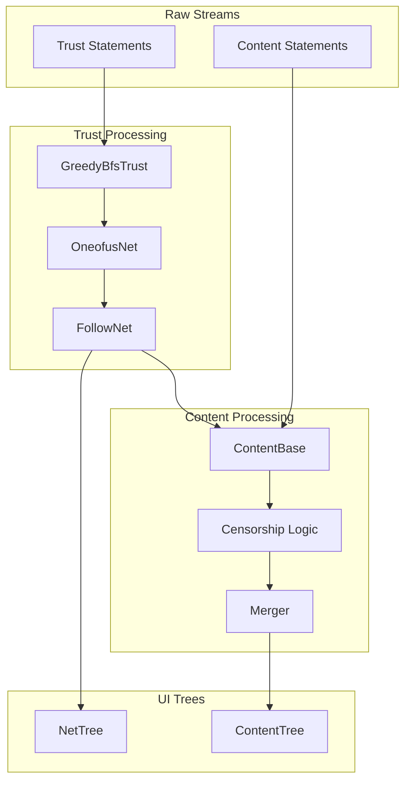

# Nerdster & ONE-OF-US.NET Data Flow & Architecture

## 1. The Trust Layer ("The Who")

The foundation of Nerdster is a decentralized Web of Trust (WoT). This layer determines *who* is in the network and *how* they are connected.

### 1.1. Input: Trust Statements
The system consumes streams of `TrustStatement`s signed by user keys. These statements define the graph topology:
*   **Trust**: "I trust Key B." (Adds an edge).
*   **Block**: "I block Key C." (Explicitly prevents an edge).
*   **Replace**: "Key A is now Key A2." (Key rotation/recovery).
*   **Delegate**: "Key A delegates to Key D for app usage." (Links Identity keys to App keys).

### 1.2. Processing: Greedy BFS Trust
The core algorithm is `GreedyBfsTrust` (`lib/trust/greedy_bfs_trust.dart`). It builds the graph starting from the user's Point of View (PoV).

*   **Algorithm**: Breadth-First Search (BFS) outward from the PoV.
*   **"Greedy" Logic**:
    *   **Closest Wins**: Statements from closer nodes (lower degree) are processed first and take precedence.
    *   **Conflict Resolution**:
        *   If a trusted node blocks X, but a closer node trusts X, the closer node wins (X is trusted).
        *   If a trusted node trusts X, but a closer node blocks X, the closer node wins (X is blocked).
    *   **Security**: This prevents distant attackers from injecting bad nodes or blocking good nodes within your trusted circle.

### 1.3. Networks
The algorithm produces two distinct networks:
1.  **OneofusNet** (`lib/net/oneofus_net.dart`): The base Identity Network. Nodes are long-lived Identity Keys.
2.  **FollowNet** (`lib/follow/follow_net.dart`): The Application Network (Nerdster).
    *   Built *on top* of OneofusNet.
    *   Nodes are App Keys (Delegates).
    *   Inherits trust from OneofusNet but allows app-specific follows/blocks.

### 1.4. Output: NetTree
The `NetTree` (`lib/net/net_tree.dart`) visualizes this graph.
*   **Root**: The user (PoV).
*   **Children**: Nodes trusted by the parent.
*   **Visuals**: Shows the path of trust to any given user.

---

## 2. The Content Layer ("The What")

Once the Trust Graph is established, the system processes content generated by the nodes in that graph.

### 2.1. Input: Content Statements
The system consumes streams of `ContentStatement`s:
*   **Rate**: "I rate 'The Matrix' 5 stars."
*   **Relate**: "'The Matrix' is related to 'Sci-Fi'."
*   **Equate**: "'Sci-Fi' is the same as 'Science Fiction'."
*   **Censor**: "Hide this content."

### 2.2. Processing: ContentBase
The `ContentBase` (`lib/content/content_base.dart`) aggregates these streams.

*   **Aggregation**:
    *   It iterates through all users in the `FollowNet`.
    *   **`Merger.merge`**: Combines individual user streams into a single, time-sorted stream (newest first).
*   **Moderation (Censorship)**:
    *   **Trust-Based**: Unlike content (sorted by time), censorship is applied based on **Trust Rank**.
    *   **Logic**: The system iterates users from "Most Trusted" to "Least Trusted".
    *   **"Deleting the Deletion"**: If a highly trusted user censors a topic, a less trusted user cannot "uncensor" it. This protects the user's view from unwanted content even if distant nodes try to spam it back into existence.

### 2.3. Output: ContentTree
The `ContentTree` (`lib/content/content_tree.dart`) displays the aggregated content.
*   **Structure**: Hierarchical (Subject -> Comments/Ratings).
*   **Filtering**: Only shows content from the trusted `FollowNet`.
*   **Sorting**: Typically by time or relevance.

---

## 3. Summary Data Flow

